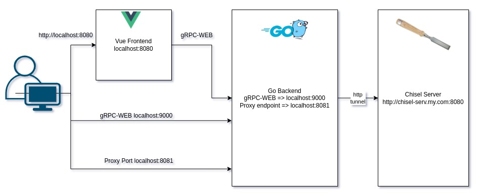

# Chisel Web Proxy

[](https://goreportcard.com/report/chisel-web-proxy) 
[](http://godoc.org/chisel-web-proxy)	
[](https://hub.docker.com/r/apavanello/chisel-web-proxy)

Uma interface web para facilitar a interação com o chisel-cliet para a abertuira de tunneis http



# Docker

## TL;DR
``` docker 
docker container run --rm --name web-proxy -d -p 80:8080 -p 8081:8081 -p 9000:9000 --mount type=bind,src=$(pwd)/data,dst=/data apavanello/chisel-web-proxy data/dataset.json
```

## variaveis no docker
### Portas
O proxy necessita de 3 portas para funcionar sendo elas:
- 8080: porta para a pagina de frontend (vuejs) `web-port`
- 8081: porta para o tunel local (podendo ser modificada no frontend) `tunnel-port`
- 9000: porta para o gRPC-WEB no backend `grpc-port`

### Dataset
O backend necessita de um arquivo json com os dados dos hosts remotos para serem utilizados no proxy. O local deve ser indentificado na chamada do docker como um volume e apontado o caminho no comando. 

## Comando Docker
``` docker
docker container run --rm --name web-proxy -p <web-port>:8080 -p <tunnel-port>:8081 -p <grpc-port>:9000 --mount type=bind,src=<dataset/folder>,dst=/data apavanello/chisel-web-proxy data/dataset.json
```

## Exemplo de Dataset
Um exemplo de dataset.json pode ser visualizado no [Dataset.json](./examples/dataset.json)

# Extras:
A Aplicação VUE.js se encontra na pasta [pkg/frontend](./pkg/frontend)
